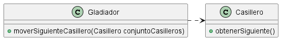

# Correcciones de la primer entrega

- `GladiadorTest` debería estar dentro de la carpeta `entrega_1`, quizás también cambiarle el nombre?
- `assertEquals(casco.getClass(), equipo.getClass())` se podría poner el equals dentro de la clase casco
- Esta bien en el equipamiento que tenga un `actualizarEquipo()` y devuelva el nuevo equipo a utilizar.
- Relacionado con el item de arriba en el `Vacio` utilizamos el _Null Pattern_ según el profe, el cual esta bien, es importante remarcar el porque lo usamos en el informe.
- En cuanto a _getters_ dijo que esta bien que en un inicio si tenemos dudas tengamos getters innecesarios y vayamos removiéndolos a medida que avanzamos en el TP
- `assertEquals(5, gladiador.getEnergia().getPuntos());` esta mal, tiene mucho acoplamiento y rompe ley de Demeter, solución: `assertEquals(new Energia(5), gladiador.getEnergia());`
- En cuanto al item de arriba le pregunte sobre que tan bueno estaba si en vez de crear la energía dentro del gladiador la recibía por inyección de dependencias en el constructor, su respuesta: no lo hagas si no es necesario(aunque en el caso de hacer mocking va a ser necesario), otra cosa que dijo que podíamos hacer es que si queremos remarcar el valor con el que inicia esa energía podemos hacer el constructor de gladiador de la siguiente manera:

  ```Java
  Gladiador(int energiaInicial) {
      this.energia = new Energia(energiaInicial);
  }
  ```

- En `Nivel.sumarPuntos` le pregunte como podríamos quitar el if de los turnos jugados, nos sugirió añadir una clase `Turno` con un hash con algo estilo asi `{8, SemiSenior}, {9, Senior}`
- Dijo que le pareció un poco raro que el `Nivel.sumarPuntos` reciba `energia`
- Finalmente le pregunte como podíamos plantear el tema del mapa/tablero y hizo un uml asi

